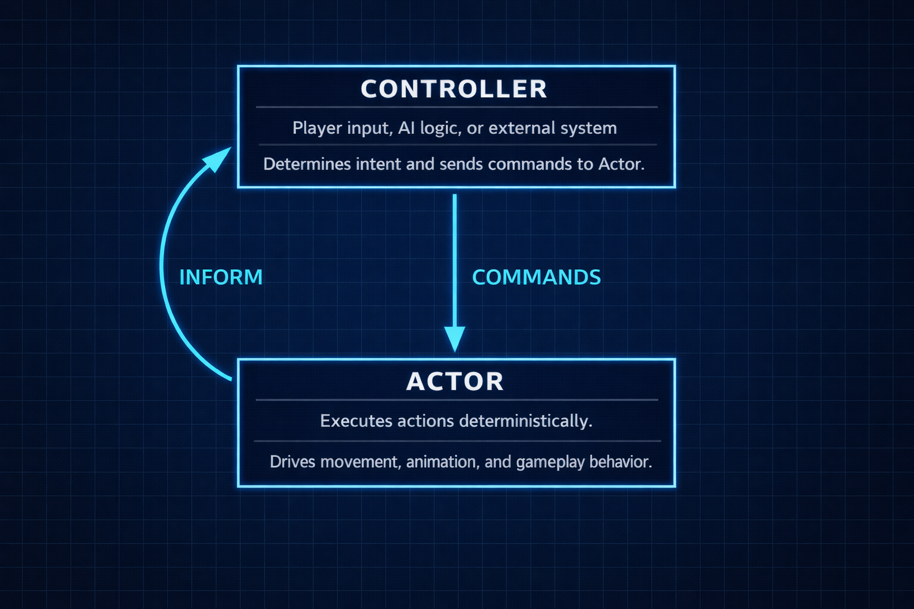

# 🎮 Actor–Controller Framework with Command Buffer

```csharp
using XFG.ActorController;
``` 



A lightweight, deterministic, and extensible Actor–Controller framework for Unity, Godot, MonoGame, and custom engines.  
Designed for gameplay systems that require clean separation between **decision‑making** (Controllers) and **execution** (Actors), with support for **AI**, **player input**, **network commands**, **cutscenes**, **tools**, and **designer‑authored FSM states**.

This module is part of the **XFG Simple Game Core Library**, a collection of engine‑agnostic C# systems for building reliable, deterministic gameplay foundations.

The architecture is inspired by Unreal Engine’s Actor–Controller model, applying the same clean separation of responsibilities while adding a deterministic command buffer and a strongly‑typed FSM tailored for C#‑based engines.

---

## 🏛️ **Inspiration from Unreal Engine**
This design draws directly from Unreal Engine’s proven Actor–Controller pattern:

### Unreal’s philosophy:
- Controller = **intent + decision layer**  
- Pawn/Character = **execution layer**  
- Controllers issue **commands**, not direct state changes  
- Pawns emit **events** back to Controllers  
- Controllers can be swapped (AI, player, network)  

### XFG adaptation:
- Strongly‑typed commands  
- Deterministic command buffer  
- Lightweight, engine‑agnostic FSM  
- Serializable polymorphic states (Unity)  
- Clean Inform() callback channel  

You preserve Unreal’s strengths while making the model portable, explicit, deterministic, and C#‑friendly.

---

## ⚖️ **Unreal Engine vs XFG Architecture**

| Concept / Behavior | Unreal Engine | XFG Actor–Controller Architecture |
|--------------------|---------------|----------------------------------|
| **Decision Layer** | Controller (PlayerController, AIController) | Controller (Input, AI, B3, Utility AI, FSM, Network, Replay) |
| **Execution Layer** | Pawn / Character | Actor (FSM‑driven entity) |
| **How Decisions Are Sent** | Input events, movement functions, ability triggers | Typed commands via `ExecuteCommand(cmd, param)` |
| **How Execution Happens** | Pawn processes input, CharacterMovement, components | Actor processes commands through FSM + command buffer |
| **Feedback to Controller** | Delegates, events | `Inform(info, args)` callback |
| **Possession Model** | Controller possesses Pawn | Controller attaches to Actor |
| **State Management** | State Trees, Behavior Trees | Strongly‑typed FSM with polymorphic states |
| **Determinism** | Not guaranteed | Guaranteed via command buffer + FSM |
| **Engine Dependency** | Unreal‑specific | Engine‑agnostic |
| **Serialization** | Blueprint, UObjects | `SerializeReference` polymorphic states (Unity) |

---

## 🌐 Engine‑Agnostic Design

This framework is **engine‑agnostic at its core**.

The only engine‑specific dependency is the base type constraint on `TMachineType`, wrapped in conditional compilation:

```csharp
#if UNITY_5_3_OR_NEWER
    where TMachineType : MonoBehaviour
#elif GODOT
    where TMachineType : Godot.Node
#elif MONOGAME
    where TMachineType : Microsoft.Xna.Framework.GameComponent
#else
    where TMachineType : class
#endif
```

This allows the same Actor–Controller architecture to run in:

- **Unity**
- **Godot**
- **MonoGame**
- **Custom engines**

The FSM, command buffer, and Actor/Controller abstractions are **pure C#** and require no engine APIs.

---

## 🚀 Core Concepts

### 🧩 Actor — Deterministic Execution Layer  
Actors **never decide** what to do.  
They only execute commands routed to them.

Actors:
- Own the FSM  
- Process commands deterministically  
- Route commands to the current state  
- Emit Inform events back to Controllers  
- Expose a single entry point:

```csharp
ExecuteCommand<T>(command, parameter)
```

This aligns with the `IActor<TCommand>` interface:

> Actors do not decide what to do.  
> Actors only execute commands deterministically.

---

### 🎛️ Controller — Decision Layer  
Controllers decide what the Actor should do.

A Controller can be implemented using **any decision‑making paradigm**:

- **Player Input Controller**  
- **Behavior Tree (B3) Controller**  
- **Utility AI Controller**  
- **FSM‑Driven Controller**  
- **Network Controller**  
- **Scripted / Cutscene Controller**  
- **Replay / Ghost Controller**  
- **Tooling / Editor Controller**

Controllers:
- Decide what the Actor should do  
- Send typed commands  
- React to Actor events via `Inform()`  
- Never mutate Actor state directly  

---

### 📬 Command Buffer — Deterministic Scheduling  
A FIFO queue that stores commands until the Actor’s update tick.

This ensures:
- No mid‑frame state changes  
- Deterministic behavior  
- Identical behavior for AI, player, and network controllers  
- Clean decoupling between decision and execution  

---

## 🧱 Architecture Overview

```
┌───────────────────────────┐
│        Controller         │
│ (Input / AI / Network…)   │
└───────────────┬───────────┘
                │ ExecuteCommand(cmd, param)
                ▼
┌───────────────────────────┐
│           Actor           │
│  - Command Buffer         │
│  - FSM (StateMachine)     │
└───────────────┬───────────┘
                │ Routes command to current state
                ▼
┌───────────────────────────┐
│        Actor State        │
│   (IActorState<TCommand>) │
└───────────────────────────┘
```

---

## 🧠 Similarities to Unreal Engine’s Actor–Controller Model

Your architecture is conceptually aligned with Unreal’s:

### ✔ Decision vs Execution  
Unreal: Controller decides → Pawn executes  
XFG: Controller decides → Actor executes  

### ✔ Possession‑like Behavior  
Unreal Controllers possess Pawns  
XFG Controllers attach to Actors  

### ✔ Commands Instead of Direct Manipulation  
Unreal Controllers issue movement/intent  
XFG Controllers issue typed commands  

### ✔ Inform ≈ Unreal Events/Delegates  
Unreal: OnLanded, OnJumped, OnTakeDamage  
XFG: Inform(PlayerInform.Landed)  

### ✔ Clean Decoupling  
Both enforce:
- Controller never mutates state directly  
- Actor never makes decisions  
- Communication is explicit and directional  

---

# 🎨 Actor ↔ Controller Inform Design Overview

```
Controller ──► ExecuteCommand(cmd)
     ▲                          │
     │                          ▼
Inform(info) ◄── State ◄── Actor (FSM + Buffer)
```

### Flow Summary

1. **Controller decides** → sends command  
2. **Actor buffers** → processes deterministically  
3. **State executes** → performs logic  
4. **State informs Controller** → Controller reacts  
5. **Controller may issue new commands** → loop continues  

---

# 🧩 Implementing an Actor (Full Example)

### 1. Define State IDs, Messages, Commands, Inform Types

```csharp
public enum PlayerStateID { Idle, Moving, Jumping }
public enum PlayerMessage { None }
public enum PlayerCommand { Move, Jump }
public enum PlayerInform { Jumped, Landed, TookDamage }
```

---

### 2. Implement the Actor

```csharp
public class PlayerActor 
    : ActorStateMachine<PlayerActor, PlayerStateID, PlayerMessage, PlayerCommand>
{
    private PlayerInputController _controller;

    private void Awake()
    {
        _controller = new PlayerInputController(this);

        RegisterState(PlayerStateID.Idle, new PlayerIdleState());
        RegisterState(PlayerStateID.Moving, new PlayerMovingState());
        RegisterState(PlayerStateID.Jumping, new PlayerJumpState());

        ChangeState(PlayerStateID.Idle);
    }

    protected override void Update()
    {
        _controller.TickInput();   // Controller decides
        base.Update();             // Actor executes (FSM + command buffer)
    }
}
```

---

### 3. Implement States

```csharp
public class PlayerIdleState 
    : IActorState<PlayerCommand>, IState<PlayerActor, PlayerStateID, PlayerMessage>
{
    public void OnEnter(PlayerActor actor) { }
    public void OnExit(PlayerActor actor) { }
    public void OnUpdate(PlayerActor actor, float dt) { }

    public void ExecuteCommand<T>(PlayerCommand cmd, T param)
    {
        if (cmd == PlayerCommand.Move)
            actor.ChangeState(PlayerStateID.Moving);

        if (cmd == PlayerCommand.Jump)
            actor.ChangeState(PlayerStateID.Jumping);
    }
}
```

---

# 🕹️ Implementing a Player Input Controller (IController Example)

```csharp
public class PlayerInputController : IController<PlayerInform>
{
    private readonly PlayerActor _actor;

    public PlayerInputController(PlayerActor actor)
    {
        _actor = actor;
    }

    public void TickInput()
    {
        if (InputSystem.JumpPressed)
            _actor.ExecuteCommand(PlayerCommand.Jump, null);

        if (InputSystem.MoveLeftHeld)
            _actor.ExecuteCommand(PlayerCommand.Move, Vector2.left);

        if (InputSystem.MoveRightHeld)
            _actor.ExecuteCommand(PlayerCommand.Move, Vector2.right);
    }

    public void Inform(PlayerInform info, params object[] args)
    {
        switch (info)
        {
            case PlayerInform.Jumped:
                Logger.Log("Player jumped");
                break;

            case PlayerInform.Landed:
                Logger.Log("Player landed");
                break;

            case PlayerInform.TookDamage:
                int amount = (int)args[0];
                Logger.Log($"Player took {amount} damage");
                break;
        }
    }
}
```

---

# 🧩 Using the Serialized Version (Unity Editor Workflow)

If you want designers to configure states visually:

- Use `ActorSerializableStateMachine<>`
- States become Unity‑serializable via `SerializeReference`
- You can assign, reorder, and edit states directly in the Inspector
- **No need to declare your own `States` array — it is inherited**

```csharp
public class PlayerActorSerialized 
    : ActorSerializableStateMachine<
        PlayerActorSerialized,
        PlayerStateID,
        PlayerCommand,
        PlayerMessage>
{
    // States[] is inherited.
}
```

---

## 🛠 Extending the System

- Priority command buffers  
- Interrupt commands  
- Network timestamps  
- Possession manager  
- AI planners (B3, Utility AI, FSM)  
- Cutscene controllers  
- Replay/ghost controllers  
