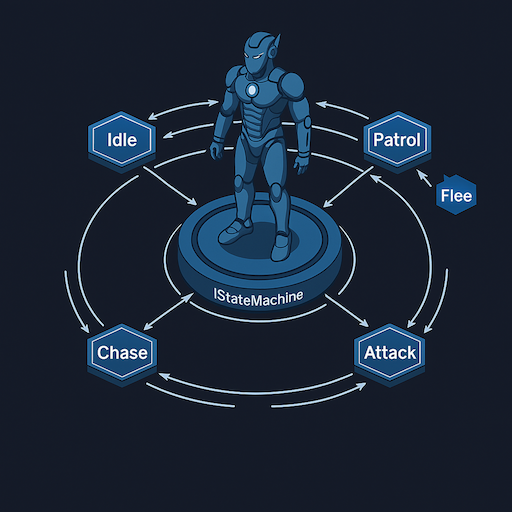

# 🧠FSMs for AI — Why They Matter

<table>
<tr>
<td width="500">



</td>
<td>

# What Is a Finite State Machine (FSM)?

- An FSM is a model where an agent is always in **exactly one state**.
- Behavior is defined by:
  - The **current state**
  - **Events or messages** the machine receives
  - **Transitions** that move the agent to a new state
- FSMs make behavior **predictable, explicit, and testable**.

## FSM for NPCs?
- AI agents need **predictable, explainable behavior**.
- FSMs model behavior as a set of **distinct modes**:
  - Idle  
  - Patrol  
  - Chase  
  - Attack  
  - Flee  
- Transitions define **when and why** the AI changes behavior.
- Guarantees the AI is always in a **valid, intentional state**.
- Perfect for enemies, companions, bosses, NPCs, and scripted sequences.


</td>
</tr>
</table>


---

# Why FSMs Are Ideal for AI

- **Deterministic** — AI is always in one clear state; behavior is predictable.
- **Modular** — each behavior lives in its own state class; no logic bleed‑through.
- **Explicit transitions** — AI only changes behavior when the machine says so.
- **Lightweight** — constant‑time updates; scales to large crowds.
- **Easy to debug** — you always know what state the AI was in and why it changed.
- **Designer‑friendly** — simple to visualize, storyboard, and tune.
- **Great for reactive AI** — messages route cleanly to the active state.
- **Ideal for phase‑based or scripted behavior** — boss phases, sequences, telegraphs.
- **Plays well with other systems** — Utility AI, Behavior Trees, Navigation, Animation.


---

# The XFG IStateMachine

**IStateMachine is XFG’s engine‑grade implementation of a Finite State Machine.**  
It provides the foundation for all XFG AI behavior systems and extension layers.

- Strongly‑typed, deterministic FSM core  
- Clean separation between machine logic and state behavior  
- Predictable transition pipeline  
- Fully compatible with:
  - XFG Async FSM  
  - XFG Pushdown FSM  
  - XFG Hierarchical FSM  
  - XFG Serializable FSM  
- Designed for clarity, extensibility, and onboarding‑friendly workflows

# IStateMachine — Core Responsibilities

- Registers states using strongly‑typed IDs.
- Tracks:
  - `CurrentStateType`
  - `CurrentState`
  - `HasState`
- Predictable 3‑step transition pipeline:
  1. Exit old state  
  2. Update active state reference  
  3. Enter new state
- Routes updates and messages to the active state only.
- No default state — transitions must be explicit.
- Foundation for Async, Pushdown, Hierarchical, and Serializable FSMs.

---

# AI Behavior Flow with IStateMachine

1. **AI receives input**  
   (player proximity, damage, timers, messages)

2. **Active state decides**  
   (Patrol decides to Chase)

3. **Machine transitions**  
   - Exit old state  
   - Update active state  
   - Enter new state  

4. **New state takes over**  
   (Chase handles movement, targeting, animation)

---

# How to Use the IStateMachine

## 1. Define State IDs
```csharp
public enum EnemyStateID { Idle, Patrol, Chase, Attack }
```

## 2. Implement State Classes
```csharp
class PatrolState : IStateMachine<Enemy, EnemyStateID, Msg>.IState
{
    public EnemyStateID ID => EnemyStateID.Patrol;
    public Enemy Machine { get; set; }

    public void OnStateEnter(EnemyStateID prev, object[] args) { }
    public void OnStateUpdate() { }
    public void OnStateExit(EnemyStateID next, object[] args) { }
    public void OnReceiveMessage(Msg msg, object[] args) { }
}
```

## 3. Register States
```csharp
RegisterState(new IdleState());
RegisterState(new PatrolState());
RegisterState(new ChaseState());
RegisterState(new AttackState());
```

## 4. Trigger Transitions
```csharp
ChangeState(EnemyStateID.Chase);
```

## 5. Tick the Machine
```csharp
void Update() => UpdateMachine();
```

## 6. Send Messages
```csharp
SendMessageToMachine(Msg.PlayerSpotted);
```

---

# Other Use Cases for FSMs

## **1. UI Navigation**
- MainMenu → Options → Controls → Back → MainMenu  
- Pushdown FSM handles modal overlays (Pause, Inventory)

## **2. Player Ability Systems**
- Idle → Charging → Firing → Cooldown  
- Async FSM handles wind‑ups, delays, cooldowns

## **3. Interaction Systems**
- Idle → Interacting → Completing → Returning  
- HFSM handles layered interactions (e.g., “Using Terminal” inside “In World”)

## **4. Animation State Logic**
- Locomotion → Movement → Running  
- HFSM models layered animation logic

## **5. Cutscenes & Scripted Sequences**
- Start → Play → Wait → End  
- Async FSM handles timing, fades, and sequencing

---

# Why This Architecture Scales

- Core FSM stays minimal and deterministic.
- Extensions add power without complexity:
  - **Async FSM** — awaitable transitions  
  - **Pushdown FSM** — stack‑based overlays  
  - **Hierarchical FSM** — parent → child behavior  
  - **Serializable FSM** — Unity‑friendly polymorphic states  
- Works for simple agents and complex multi‑layered systems.

---

# Alternative: XFG Utility AI
If your AI requires **continuous decision‑making**, **weighted scoring**, or **dynamic prioritization** rather than discrete modes,  
you can use **XFG Utility AI** as an alternative or complement to FSMs.

- Great for agents that must evaluate many factors at once  
- Produces smooth, context‑aware decisions  
- Works alongside FSMs (e.g., Utility AI chooses the state, FSM executes it)

