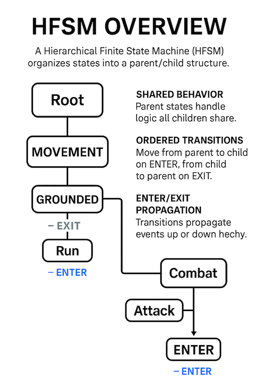

# 🌲 HierarchicalStateMachine  
```csharp
using XFG.AI.FSM.HFSM;
``` 
### 🎮 Hierarchical Finite State Machine (HFSM) for Unity

The `HierarchicalStateMachine` module extends `IStateMachine` with support for **parent/child state trees**, enabling complex behavior modeling while keeping logic modular and maintainable.

This document describes the architecture, design goals, and usage patterns for the hierarchical FSM layer.

For the base FSM, see:  
[StateMachine ReadMe](README-StateMachine.md)

For async support, see:  
[Async StateMachine - ReadMe](README-AsyncStateMachine.md)

---

## What Is an HFSM?

A **Hierarchical Finite State Machine (HFSM)** is an extension of a traditional FSM that organizes states into a **parent/child hierarchy**, allowing complex behaviors to be modeled in a clean, modular, and scalable way.

Instead of every state existing at the same level, an HFSM introduces **layers of abstraction**:

- **Parent states** define shared behavior, rules, and transitions.  
- **Child states** inherit that behavior and add their own specialized logic.  
- **Transitions** can occur at any level of the hierarchy.  
- **Enter/Exit events** propagate through the hierarchy in a predictable order.

This structure mirrors how real gameplay logic is often organized:

- Movement → Grounded → Running  
- Combat → Melee → Combo  
- AI → Alert → Chase → Attack  



HFSMs reduce duplication, improve clarity, and scale cleanly as complexity grows.

---

## Features

### Hierarchical State Trees

HFSM allows states to be organized into parent/child relationships:

- Parent states contain shared logic  
- Child states override or extend behavior  
- Transitions may occur at any level  
- Enter/Exit events propagate through the hierarchy  

---

### Shared Behavior Through Parent States

Parent states can define:

- Shared movement logic  
- Shared animation layers  
- Shared message handling  
- Shared transitions  

Child states inherit this behavior automatically.

---


### Ordered Enter/Exit Propagation

When transitioning between hierarchical states, the machine guarantees:

1. Exit from deepest child → up to common ancestor  
2. Enter from common ancestor → down to new child  

This ensures predictable and engine‑grade behavior.

---

### Fully Compatible With Base FSM

HFSM is implemented as an extension layer:

- No changes to the base `IStateMachine`  
- Synchronous and async states both supported  
- Works seamlessly with message routing  
- Works with any state ID enum  

---

## Enter/Exit Propagation (ASCII Diagram)

### 1. Transition: Idle → Run  
Where:
- `Grounded` is the parent of both `Idle` and `Run`

State Tree:
    Grounded
    ├── Idle
    └── Run

Transition:
    Idle → Run

Propagation Order:

    Exit: Idle
    (common ancestor = Grounded)
    Enter: Run

Diagram:

    [Grounded]
        ├── [Idle]   -- EXIT
        └── [Run]    -- ENTER

### 2. Transition: Run → Jump  
Where:
- `Grounded` is the parent of `Run`
- `Airborne` is the parent of `Jump`
- `Grounded` and `Airborne` share no parent (siblings at root)

State Tree:
    Root
    ├── Grounded
    │     ├── Idle
    │     └── Run
    └── Airborne
          ├── Fall
          └── Jump

Transition:
    Run → Jump

Propagation Order:

    Exit: Run
    Exit: Grounded
    (common ancestor = Root)
    Enter: Airborne
    Enter: Jump

Diagram:

    [Root]
      ├── [Grounded]
      │       └── [Run]     -- EXIT
      └── [Airborne]
              └── [Jump]    -- ENTER


### 3. Transition: Attack → Combo  
Where:
- `Combat` is the parent of both `Attack` and `Combo`

State Tree:
    Combat
    ├── Attack
    └── Combo

Transition:
    Attack → Combo

Propagation Order:

    Exit: Attack
    (common ancestor = Combat)
    Enter: Combo

Diagram:

    [Combat]
        ├── [Attack]   -- EXIT
        └── [Combo]    -- ENTER

### 4. Transition: Idle → Attack (Cross‑branch)

State Tree:
    Root
    ├── Movement
    │     ├── Idle
    │     └── Run
    └── Combat
          ├── Attack
          └── Recover

Transition:
    Idle → Attack

Propagation Order:

    Exit: Idle
    Exit: Movement
    (common ancestor = Root)
    Enter: Combat
    Enter: Attack

Diagram:

    [Root]
      ├── [Movement]
      │       └── [Idle]     -- EXIT
      └── [Combat]
              └── [Attack]   -- ENTER

---

## Architecture
`HierarchicalStateMachineExtensions`
- `RegisterChildState`
- `RegisterParentState`
- `ChangeStateHierarchical`
- `GetParent`
- `GetChildren`

`IHierarchicalState` (optional)
- `ParentID`
- `ChildrenIDs`


Hierarchy is defined explicitly through registration.

---

## Example: Defining Parent and Child States

```csharp
// -------------------------------
// Example Parent State
// -------------------------------
public class GroundedState :
    IStateMachine<PlayerMachine, PlayerStateID, PlayerMessage>.IState
{
    public PlayerMachine Machine { get; set; }
    public PlayerStateID ID => PlayerStateID.Grounded;

    public void OnStateEnter(PlayerStateID prev, object[] args)
    {
        Machine.EnableGravity(true);
    }
}

// -------------------------------
// Example Child State
// -------------------------------
public class RunState :
    IStateMachine<PlayerMachine, PlayerStateID, PlayerMessage>.IState,
    IHierarchicalState<PlayerStateID>
{
    public PlayerMachine Machine { get; set; }
    public PlayerStateID ID => PlayerStateID.Run;
    public PlayerStateID ParentID => PlayerStateID.Grounded;

    public void OnStateUpdate()
    {
        Machine.Move(Machine.Input.MoveVector);
    }
}
```

## Example: Registering Hierarchy

```csharp
RegisterState(new GroundedState());
RegisterState(new RunState());

RegisterChildState(PlayerStateID.Grounded, PlayerStateID.Run);
```

## Example: Transitioning
```csharp
ChangeStateHierarchical(PlayerStateID.Run);
```
This will:
- Enter Grounded (if not already active)
- Enter Run

## When to Use HFSM

Use this module when your gameplay requires:

- Shared logic across multiple states  
- Clean separation of parent vs. child behavior  
- Complex AI or animation state trees  
- Modular and scalable state organization  

HFSM keeps your logic clean, predictable, and easy to extend.

---

## Design Goals

### Clarity  
Hierarchy should simplify logic, not complicate it.

### Extensibility  
HFSM is optional and layered on top of the base FSM.

### Maintainability  
Parent/child relationships are explicit and easy to reason about.

### Engine-Grade Reliability  
Enter/Exit propagation is deterministic and ordered.

