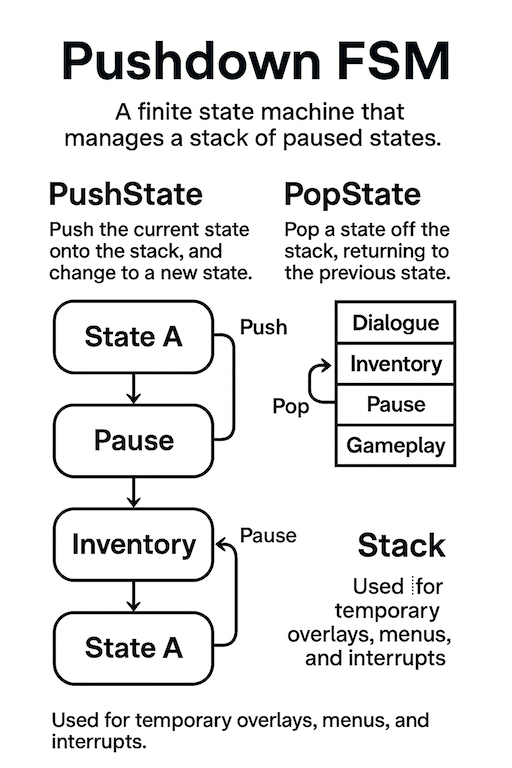

# 📚 PushdownStateMachine  
```csharp
using XFG.AI.FSM.Pushdown;
``` 
### 🎮 Stack-Based Finite State Machine for Unity

The `PushdownStateMachine` module extends the core `IStateMachine` with **stack-based state control**, enabling temporary overlays, interruptible gameplay, and automatic return-to-previous behavior.

This is ideal for menus, cutscenes, stun states, dialogue windows, and any situation where gameplay should pause and resume cleanly.

For the base FSM, see:  
[StateMachine ReadMe](README-StateMachine.md)

For async support, see:  
[Async StateMachine - ReadMe](README-AsyncStateMachine.md)

For Hierarchical FSM support, see:  
[HFSM - ReadMe](README-HierarchicalStateMachine.md)

---

## What Is a Pushdown FSM?

A **Pushdown Finite State Machine (Pushdown FSM)** is an extension of a traditional FSM that adds a **stack** to manage state transitions.  
Instead of always replacing the current state, a Pushdown FSM allows states to be:

- **Pushed** onto the stack (overlaying a new state)  
- **Popped** off the stack (returning to the previous state)  

This makes it ideal for modeling **temporary, interruptible, or nested** behaviors.

Where a normal FSM can only move from one state to another, a Pushdown FSM can *pause* the current state, activate a new one, and later *resume* exactly where it left off.

### Why This Matters

Many gameplay scenarios involve **interruptions**, **overlays**, or **nested flows**, such as:

- Pause menu  
- Inventory screen  
- Dialogue window  
- Cutscenes  
- Stun / Hit‑react  
- Nested UI menus  
- Scripted sequences  

A Pushdown FSM handles these naturally:
- Push(Pause)
- Push(Inventory)
- Pop() → back to Pause
- Pop() → back to Gameplay


No manual bookkeeping. No “previousState” variables. No brittle return logic.

---

### How It Works

A Pushdown FSM maintains:

- A **current state** (top of the stack)  
- A **stack of previous states**  

#### When you call: `PushState(X)`

The machine:

1. Saves the current state ID on the stack  
2. Transitions into state X  

#### When you call: `PopState()`

The machine:

1. Pops the previous state ID  
2. Transitions back into it  

This guarantees deterministic, engine‑grade behavior with minimal code.

---
## 🧭 Pushdown FSM Overview

This diagram illustrates how a Pushdown Finite State Machine (FSM) manages temporary overlays and automatic return-to-previous behavior using a stack.



---

### 🔄 PushState Flow

Each time a new state is pushed:

- The current state is saved on the stack  
- The machine transitions into the new state  

Example sequence:

`Gameplay`  
**↓ Push**  
`Pause`  
**↓ Push**  
`Inventory`  
**↓ Push**  
`Dialogue`

Each push adds a new state on top of the stack.

---

### ↩️ PopState Flow

Each time a state is popped:

- The top state is removed from the stack  
- The machine returns to the previous state  

Example sequence:

`Dialogue`  
**↑ Pop**  
`Inventory`  
**↑ Pop**  
`Pause`  
**↑ Pop**  
`Gameplay`


Only the top state is active. Popping restores the previous one.

---

### 💡 Key Concepts

- **Temporary overlays** — Pause, Inventory, Dialogue, etc.  
- **Automatic return** — No manual bookkeeping required  
- **Stack-based transitions** — Clean, scalable, and engine-grade

Pushdown FSMs are ideal for interruptible gameplay, nested UI flows, and scripted sequences.


## Features

### Stack-Based Transitions


| Function              | Stack Change | Description |
|----------------------|--------------|-------------|
| PushState            | Push         | Overlay a new state and preserve the current one |
| PopState             | Pop          | Return to the previous state |
| ReplaceState         | None         | Swap the active state without touching the stack |
| ReplaceTopAndPush    | Push         | Push current, then replace with a new state |
| PeekState            | None         | Inspect the next state to be restored |
| StackDepth           | None         | Query number of paused states |
| ClearStateStack      | Clear        | Reset all paused states |

---

## Usage Notes

- Only the top state is active.
- All other states remain suspended until popped.
- Pushdown FSM integrates cleanly with async states, HFSM, and message routing.
- No modifications to the base `IStateMachine` are required.

This module provides predictable, engine-grade stack behavior suitable for gameplay, UI, and scripted sequences.


This allows clean modeling of:

- Pause → Inventory → Dialogue → Resume  
- Stun → Recover → Return to Combat  
- Cutscene → Gameplay → Cutscene → Gameplay  
- Nested menus and UI flows  

---

## Why Use a Pushdown FSM?

### Perfect for Temporary States  
Pause menus, overlays, and interrupts no longer require manual bookkeeping.

### Automatic Return Behavior  
`PopState()` restores the exact previous state — no extra logic needed.

### Nested Context  
Stack depth naturally represents nested UI or gameplay layers.

### Clean Integration  
Works directly with the base `IStateMachine` without modifying it.

---

## Architecture

`PushdownStateMachineExtensions`
- `PushState`
- `PopState`
- `ClearStateStack`

Internal:
`Dictionary<object, Stack<object>>`   
One stack per machine instance


The pushdown layer is implemented as a pure extension — no inheritance required.

---

## Example: Push / Pop Flow

```csharp
// Enter Pause state, preserving gameplay state
machine.PushState(PlayerStateID.Pause);

// Open Inventory inside Pause
machine.PushState(PlayerStateID.Inventory);

// Close Inventory → return to Pause
machine.PopState();

// Close Pause → return to gameplay
machine.PopState();
```
## Example: Pushdown Extension Methods
```csharp
machine.PushState(PlayerStateID.Dialogue);
machine.PopState();
machine.ClearStateStack();
```
These operations integrate seamlessly with your existing state logic.

## Example: State Definition (unchanged)
Pushdown FSM does not require special state types:
```csharp
public class PauseState :
    IStateMachine<PlayerMachine, PlayerStateID, PlayerMessage>.IState
{
    public PlayerMachine Machine { get; set; }
    public PlayerStateID ID => PlayerStateID.Pause;

    public void OnStateEnter(PlayerStateID prev, object[] args)
    {
        Machine.UI.ShowPauseMenu();
    }

    public void OnStateExit(PlayerStateID next, object[] args)
    {
        Machine.UI.HidePauseMenu();
    }
}
```
## When to Use PushdownStateMachine

Use this module when your gameplay requires:

- Temporary overlays  
- Interruptible states  
- Nested UI flows  
- Clean return-to-previous behavior  
- Minimal boilerplate for pause/resume logic  

Pushdown FSM keeps your logic clean, predictable, and scalable.

---

## Design Goals

### Clarity  
Push/pop semantics should be intuitive and easy to reason about.

### Extensibility  
Works with async states, HFSM, and message routing.

### Safety  
Each machine instance maintains its own stack.

### Engine-Grade Reliability  
Deterministic transitions with guaranteed enter/exit ordering.

