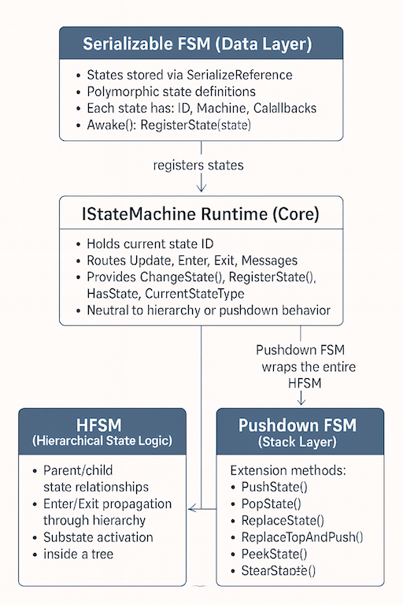

# 🧩 Serializable FSM

```csharp
using XFG.AI.FSM.Serializable;
``` 

A Unity-compatible wrapper around `IStateMachine<TMachine, TStateID, TMessage>`  
that enables polymorphic state definitions using `SerializeReference` while preserving  
full compatibility with HFSM and Pushdown FSM layers.

This module acts as the **data-driven front end** of your FSM architecture, bridging  
Unity’s serialization system with your runtime state machine engine.

For the base FSM, see:   
[State Machine Readme](README-StateMachine.md)

For async support, see:  
[Async StateMachine - ReadMe](README-AsyncStateMachine.md)

For Hierarchical FSM support, see:  
[HFSM - ReadMe](README-HierarchicalStateMachine.md)

For Pushdown FSM support, see:  
[Pushdown State Machine - ReadMe](README-PushdownStateMachine.md)

🧭 Integration Diagram



---

## 📦 Purpose

The Serializable FSM exists to solve a core limitation in Unity:

**Unity cannot serialize polymorphic classes by default.**

This module provides:

- Polymorphic state serialization via `SerializeReference`
- Inspector-visible state definitions
- Runtime registration of all states in `Awake()`
- Clean separation between:
  - Serialized state data
  - Runtime FSM execution
  - Higher-level flow control (HFSM + Pushdown FSM)

It allows you to define states as **plain C# classes**, not ScriptableObjects or MonoBehaviours.

---

## 🎛️ Unity Inspector Support

The Serializable FSM is designed to work seamlessly with the Unity Inspector.

### How it works

- States are stored in a `SerializeReference` array.
- Unity displays each state as an expandable object.
- You can add, remove, reorder, and configure states directly in the Inspector.
- Derived state classes appear in Unity’s type-selection dropdown.
- All fields inside each state class are serialized normally.

### Benefits

- **Designer-friendly**: States can be configured without touching code.
- **Prefab-driven FSMs**: Different prefabs can have different state sets.
- **Variant behaviors**: Enemy types, NPCs, UI flows can each have unique state lists.
- **Rapid iteration**: Change state parameters without recompiling.
- **Full polymorphism**: Any derived state type can be added to the list.

### Example Inspector Workflow

1. Add your machine component to a GameObject.
2. Expand the `States` list.
3. Click `+` to add a new state.
4. Choose a derived state class from the dropdown.
5. Configure its fields (speed, timers, thresholds, etc.).
6. Press Play — the machine registers all states automatically.

This turns your FSM into a **fully serialized, designer-editable system**.

---

## 🧠 Core Class

```csharp
ISerializableStateMachine<TMachineType, TState, TStateIDType, TMessageType>
```
### Inherits

```csharp
IStateMachine<TMachineType, TStateIDType, TMessageType>
```

### Generic Constraints
- `TMachineType : MonoBehaviour`  
- `TStateIDType : IComparable`  
- `TMessageType : IComparable`  
- `TState : ISerializableState`  


This ensures:

- Unity lifecycle compatibility  
- Comparable state IDs  
- Comparable message types  
- Strong typing for serialized states  

---

## 🗂️ Serialized State List

```csharp
[SerializeReference, Core.SerializableClass]
public TState[] States;
```

### Why this is important
Supports polymorphic state definitions

Unity can serialize derived classes

States appear directly in the inspector

Each state is registered automatically in **Awake()**

## 🔄 Lifecycle

```csharp
protected override void Awake()
{
    base.Awake();
    foreach (TState state in States)
        RegisterState(state);
}
```

## Guarantees
- All states are registered before any transitions
- Pushdown FSM operations always have valid targets
- HFSM can resolve parent/child relationships
- Message routing is fully initialized

## 🧱 Nested Class: `ISerializableState`

### Implements
`IState`

```csharp
public abstract TStateIDType ID { get; }
public TMachineType Machine { get; set; }
```

### Optional Callbacks

```csharp
public virtual void OnStateEnter(TStateIDType prevStateType, object[] args) { }
public virtual void OnStateUpdate() { }
public virtual void OnStateExit(TStateIDType nextStateType, object[] args) { }
public virtual void OnReceiveMessage(TMessageType msgtype, object[] args) { }
```


### Notes

- `Machine` is assigned automatically by `RegisterState`  
- States remain plain C# classes  
- No Unity-specific inheritance required  

---

## Compatibility

| System         | Compatible | Notes |
|----------------|------------|-------|
| HFSM           | Yes        | Supports parent/child hierarchy and substate activation. Serializable states integrate cleanly with hierarchical transitions. |
| Pushdown FSM   | Yes        | Fully compatible with PushState, PopState, ReplaceState, ReplaceTopAndPush, PeekState, and StackDepth. All states are registered before first transition. |
| Unity Editor   | Yes        | States are visible and editable via SerializeReference. Polymorphic state definitions are supported. |
| Domain Reload  | Yes        | SerializeReference ensures state objects survive reloads without losing type information. |

---

## 🧪 Example Usage

```csharp
public class PlayerMachine 
    : ISerializableStateMachine<PlayerMachine, PlayerState, PlayerStateID, PlayerMessage>
{
    // States defined in inspector
}

public class PlayerIdleState : PlayerMachine.ISerializableState
{
    public override PlayerStateID ID => PlayerStateID.Idle;

    public override void OnStateEnter(PlayerStateID prev, object[] args)
    {
        // Enter logic
    }
}
```
