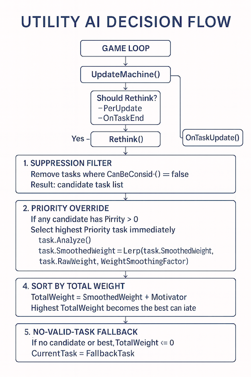

# 🧠Utility AI Framework

```csharp
using XFG.AI.UAI;
``` 
### 🎮 A Lightweight, Deterministic, Allocation-Free Decision System

## What Is a Utility AI?

A **Utility AI** is a decision-making system where each possible action (called a *task*) continuously evaluates how desirable it is based on the current game state.  
Instead of rigid transitions (like a traditional FSM), each task computes a **utility score** — a numerical value representing how appropriate or valuable that action is right now.

The AI then selects the task with the highest score.

This approach allows:

- Smooth, context-aware decision making  
- Dynamic prioritization based on changing conditions  
- More natural, less predictable behavior  
- Easy extensibility — add new tasks without rewriting transitions  
- Designer-friendly tuning through weights, curves, and motivators  

Utility AI is widely used in modern games for enemies, companions, crowds, and systemic agents because it scales cleanly and behaves intelligently under complex conditions.

For Serializable UAI support, see:  
[Serializable Utility AI - ReadMe](README-SerializableUtilityAI.md)

## Implementation

The Utility AI Framework provides a modular, extensible decision controller for real-time gameplay systems. It evaluates a set of tasks (behaviors) using suppression rules, weighted scoring, smoothing, motivators, and optional priority overrides to determine the most appropriate action at any moment.

This implementation is optimized for:
- Zero allocations per rethink
- No Linq
- Deterministic behavior
- Unity IL2CPP compatibility
- Clean task lifecycle management
- Designer-friendly task authoring

---

## Features

### 1. Suppression Filtering
Each task can declare whether it is eligible via:

```csharp
bool CanBeConsidered();
```

This cleanly separates eligibility from scoring.

---

### 2. Weighted Scoring with Smoothing
Tasks compute a raw weight in Analyze(). The controller applies smoothing to prevent oscillation:

```csharp
SmoothedWeight = Lerp(SmoothedWeight, RawWeight, WeightSmoothingFactor);
```

This produces stable, believable behavior.

---

### 3. Priority Overrides
Tasks may declare a Priority > 0 to immediately override normal scoring. Useful for urgent or interrupt-driven behaviors.

---

### 4. Fallback Behavior
If no valid task exists, the system selects a designated fallback task. Agents never enter undefined or idle states unintentionally.

---

### 5. Full Task Lifecycle
Each task receives:
- OnTaskEnter(previous)
- OnTaskUpdate()
- OnTaskExit()
- OnTaskDone()
- OnTaskInterrupted()

This ensures clean transitions and predictable behavior.

---

### 6. Rethink Frequency Control
Supports three modes:
- PerUpdate — evaluate every frame
- PerNTime — evaluate every N seconds
- OnTaskEnd — evaluate only when a task completes or fails

---

### 7. Zero Allocations
The controller uses a reusable candidate buffer:

```csharp
readonly List<ITask> _candidateBuffer = new List<ITask>(16);
```

No Linq. No per-frame allocations. No GC spikes.

---

## Decision Flow



---

## Task Interface

A task implements:

```csharp
public interface ITask
{
    float RawWeight { get; set; }
    float SmoothedWeight { get; set; }
    float Motivator { get; set; }
    float TotalWeight { get; }

    int Priority { get; }
    RethinkFrequency Frequency { get; }

    bool CanBeConsidered();
    void Analyze();

    void OnTaskEnter(ITask previous);
    void OnTaskUpdate();
    void OnTaskExit();
    void OnTaskDone();
    void OnTaskInterrupted();
    void OnReceiveMessage(TMessageType msg, object[] args);
    Consideration OnReconsider();
}
```

---

## Rethink Flow

1. Suppression Filter — Remove tasks that cannot be considered.  
2. Priority Override — If any task has Priority > 0, select it immediately.  
3. Analyze + Smooth — Compute raw weights and apply smoothing.  
4. Sort by Total Weight — Highest weight wins.  
5. Fallback — If no valid task exists, use fallback.  
6. Switch Task — Exit previous → enter new → update loop continues.

---

## Integration Example

```csharp
public class EnemyAI : IUtilityAI<EnemyAI, EnemyMessage>
{
    protected override void Awake()
    {
        RegisterTask(new PatrolTask());
        RegisterTask(new ChaseTask());
        RegisterTask(new AttackTask());

        FallbackTask = new IdleTask();
    }
}
```

---

## Why This System?

This Utility AI framework is built for:
- High-performance gameplay loops
- Predictable behavior under load
- Designer-friendly task creation
- Scalable decision logic
- Zero-GC runtime execution

It fits naturally alongside your FSM and Pushdown FSM systems, giving you a complete behavior architecture stack.

